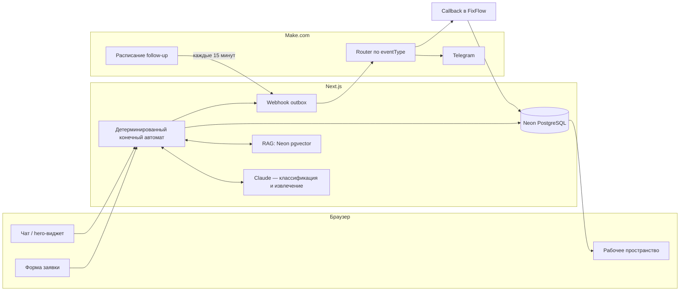

# FixFlow AI

**AI-диспетчер и операционная система для выездных сервисных компаний.**

🔗 **Живой продукт:** [fixflow-ai-661.netlify.app](https://fixflow-ai-661.netlify.app)

Клиент пишет в чат, что сломалось → AI определяет направление и услугу →
отвечает по базе знаний компании через RAG → собирает контакты → предлагает
свободное время → создаёт заявку и бронирование → заявка сразу видна
диспетчеру в рабочем пространстве → уходит webhook в Make → Make шлёт
уведомление в Telegram и подтверждает доставку обратным callback.


_Главная страница с встроенным чатом-диспетчером в hero._

## Попробовать за 2 минуты

1. Откройте [чат](https://fixflow-ai-661.netlify.app/chat) и опишите проблему
   своими словами — например, «не работает стиральная машина, не сливает
   воду».
2. Ответьте на пару вопросов: имя, тестовый телефон вида `+7 000 000 1042`,
   район Москвы, дату и время выезда.
3. Заявка сразу появится в [рабочем пространстве](https://fixflow-ai-661.netlify.app/workspace/leads).
   Откройте её — раздел «Почему AI так ответил?» показывает источники RAG, а
   `/workspace/automations` — журнал webhook-событий Make.


_Гибридный чат: Claude классифицирует и извлекает данные, но каждый шаг
проверяет и решает детерминированный сервер._

Все данные в рабочем пространстве вымышленные, номера телефонов используют
код `+7 000`, не выделенный ни одному реальному оператору — заявки нельзя
спутать с настоящими клиентами, а ввести туда реальные личные данные
физически бессмысленно.

## Что реализовано

- **Гибридный чат.** Claude классифицирует намерение, извлекает структурные
  данные и предлагает следующий вопрос; детерминированный конечный автомат
  независимо проверяет каждое поле и решает, какое действие разрешено. При
  недоступности LLM, невалидном JSON или низкой confidence сценарий
  продолжает работать без модели.
- **RAG на Neon pgvector.** Локальные детерминированные embeddings,
  HNSW cosine-индекс, порог similarity и grounding-проверка — AI не
  придумывает цены, гарантию или зону обслуживания при отсутствии источника.
- **Публичное рабочее пространство.** Kanban по пяти статусам, фильтры и
  поиск, карточка заявки с историей диалога, разделом «Почему AI так
  ответил?» и журналом интеграций — обновляется без rebuild.
- **Контур автоматизаций Make.** Next.js только создаёт события и отправляет
  webhook; маршрутизация по типу события, Telegram-уведомления, отложенные
  follow-up и напоминания, идемпотентный callback — на стороне Make.
- **Публичная форма заявки** с honeypot, rate limit в Neon и идемпотентным
  ключом — параллельный вход в тот же пайплайн без чата.


_Kanban-доска заявок: реальные московские районы, цены из прайса услуги,
статус вместо восьми деталей демо-разметки._


_Раздел «Почему AI так ответил?» — источники RAG, confidence, модель и
длительность запроса._

## Технологии

Next.js 16 (App Router, TypeScript, `src`), Tailwind CSS и shadcn/ui, Drizzle
ORM, Neon PostgreSQL + pgvector, Claude Messages API (server-only), Vitest,
Netlify. Make.com владеет Telegram-доставкой и отложенными автоматизациями —
внутри Next.js нет cron, таймеров и очередей.

## Архитектура



Полное описание — в [`docs/architecture.md`](docs/architecture.md). Каждое
нетривиальное инженерное решение и почему оно принято именно так — в
[`docs/decisions.md`](docs/decisions.md) (22 задокументированных решения).
Хронология работы — в [`docs/progress.md`](docs/progress.md).

## Для технического ревью

- [`/workspace/ai-runs`](https://fixflow-ai-661.netlify.app/workspace/ai-runs) —
  каждый вызов LLM: вход, confidence, найденные RAG-чанки, длительность.
- [`/workspace/automations`](https://fixflow-ai-661.netlify.app/workspace/automations) —
  webhook-события и callback от сценариев Make, статус доставки.
- `docs/decisions.md` — например, почему `expires_at` на пользовательских
  заявках проверялся только при записи, но не при чтении (найдено и
  исправлено), или почему маркер безопасности базы знаний остаётся в файле,
  но не должен попадать в эмбеддинги.

## Локальная настройка

1. Установите зависимости:

   ```bash
   npm install
   ```

2. Скопируйте `.env.example` в `.env.local` и добавьте два Neon connection
   string:

   - `DATABASE_URL` — pooled URL для приложения;
   - `DATABASE_URL_DIRECT` — direct URL для миграций.

   Для Claude также задайте:

   - `LLM_BASE_URL` — `https://api.anthropic.com` или полный Messages endpoint;
   - `LLM_API_KEY` — секретный Claude API key;
   - `LLM_MODEL` — доступная вашему ключу модель.

3. Примените миграции и запустите приложение:

   ```bash
   npm run db:migrate
   npm run dev
   ```

По умолчанию приложение доступно на
[http://localhost:3000](http://localhost:3000). Проверка базы:
`GET /api/health/db`.

Публичная клиентская часть:

```text
/
/chat
/request
/request/success
```

Гибридный чат работает через `POST /api/chat/start` и
`POST /api/chat/message`. Claude классифицирует запрос и извлекает данные, но
сервер самостоятельно проверяет поля и выбирает действие. При ошибке или
отсутствии LLM автоматически используется детерминированный сценарий.

Обычная форма принимает только вымышленные данные и безопасные тестовые
телефоны с кодом `+7 000`. После отправки она показывает номер заявки и
предлагает свободное время; новая запись сразу доступна в рабочем
пространстве.

Публичное рабочее пространство доступно без регистрации и логина:

```text
/workspace/leads
/workspace/leads/[id]
/workspace/knowledge
/workspace/ai-runs
/workspace/automations
```

## Команды базы данных

```bash
npm run db:generate
npm run db:migrate
npm run db:studio
```

## Демонстрационные данные

```bash
npm run demo:seed
npm run demo:reset
npm run knowledge:seed
```

`demo:seed` идемпотентно создаёт канонический набор вымышленных данных
FixFlow Service. `demo:reset` удаляет только записи с `is_seed=true` и создаёт
этот набор заново. Команды не запускаются автоматически и не изменяют схему.

`knowledge:seed` читает только `.md` и `.txt` из `knowledge/demo`, создаёт
chunks и 1536-мерные embeddings и идемпотентно сохраняет их в Neon. При
информационном вопросе чат ищет максимум пять chunks выбранной категории и
`common`, а затем показывает пользователю источники ответа.

## Проверки

```bash
npm run lint
npm run typecheck
npm test
npm run build
npm run check
```

Целевая платформа размещения — Netlify.
