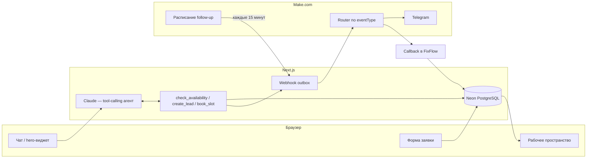

# FixFlow AI

**AI-диспетчер и операционная система для выездных сервисных компаний.**

🔗 **Живой продукт:** [fixflow-ai-kappa.vercel.app](https://fixflow-ai-kappa.vercel.app)

Клиент пишет в чат, что сломалось → Claude ведёт диалог сам, знает весь
прайс и базу знаний наизусть → уточняет детали и контакты → сам вызывает
проверку свободного времени и бронирование → заявка сразу видна диспетчеру
в рабочем пространстве → уходит webhook в Make → Make шлёт уведомление в
Telegram и подтверждает доставку обратным callback.


_Главная страница с встроенным чатом-диспетчером в hero._

## Попробовать за 2 минуты

1. Откройте [чат](https://fixflow-ai-kappa.vercel.app/chat) и опишите проблему
   своими словами — например, «не работает стиральная машина, не сливает
   воду».
2. Ответьте на пару уточняющих вопросов: имя, тестовый телефон вида
   `+7 000 000 1042`, район Москвы — Claude сам предложит реальное свободное
   время.
3. Заявка сразу появится в [рабочем пространстве](https://fixflow-ai-kappa.vercel.app/workspace/leads).
   Откройте её — раздел «Почему AI так ответил?» показывает каждый ход
   диалога: какие инструменты вызвал агент, модель и длительность запроса, а
   `/workspace/automations` — журнал webhook-событий Make.


_Диалог ведёт Claude: сам решает, что спросить и когда вызвать проверку
доступности или создание заявки — каждый вызов инструмента независимо
проверяется сервером перед записью в базу._

Все данные в рабочем пространстве вымышленные, номера телефонов используют
код `+7 000`, не выделенный ни одному реальному оператору — заявки нельзя
спутать с настоящими клиентами, а ввести туда реальные личные данные
физически бессмысленно.

## Что реализовано

- **Чат — tool-calling агент.** Claude Messages API ведёт весь диалог сам
  (что спросить, в каком порядке, как сформулировать) и вызывает
  `check_availability`/`create_lead`/`book_slot`, когда у него есть нужные
  данные. Модель никогда не пишет в базу напрямую: каждый обработчик
  инструмента независимо валидирует аргументы (формат телефона,
  сопоставление услуги с реальным каталогом, атомарный захват слота) перед
  записью — «LLM предлагает, детерминированный сервер решает и владеет
  записью».
- **Знания зашиты в промпт.** Прайс и база знаний (FAQ, гарантия, зона
  обслуживания) читаются из Neon и подставляются в system prompt целиком —
  без отдельного шага поиска, значит и без риска, что поиск и диалог
  разойдутся между собой.
- **Публичное рабочее пространство.** Kanban по пяти статусам, фильтры и
  поиск, карточка заявки с историей диалога, разделом «Почему AI так
  ответил?» и журналом интеграций — обновляется без rebuild.
- **Контур автоматизаций Make.** Next.js только создаёт события и отправляет
  webhook; маршрутизация по типу события, Telegram-уведомления, отложенные
  follow-up и напоминания, идемпотентный callback — на стороне Make.
- **Публичная форма заявки** с honeypot, rate limit в Neon и идемпотентным
  ключом — параллельный вход в тот же пайплайн без чата.


_Kanban-доска заявок: реальные московские районы, цены из прайса услуги,
статус вместо восьми деталей демо-разметки._


_Раздел «Почему AI так ответил?» — какие инструменты вызвал агент, модель и
длительность запроса._

## Технологии

Next.js 16 (App Router, TypeScript, `src`), Tailwind CSS и shadcn/ui, Drizzle
ORM, Neon PostgreSQL, Claude Messages API через `@anthropic-ai/sdk`
(server-only, tool calling), Vitest, Vercel (git-connected — пуш в `main`
деплоит автоматически). Make.com владеет Telegram-доставкой и отложенными
автоматизациями — внутри Next.js нет cron, таймеров и очередей.

## Архитектура



Полное описание архитектуры сейчас частично устарело (описывает схему до
рефакторинга чата) — актуальную версию ищите в
[`docs/decisions.md`](docs/decisions.md), решения D-032 и D-033. Каждое
нетривиальное инженерное решение и почему оно принято именно так — там же.
Хронология работы — в [`docs/progress.md`](docs/progress.md).

## Для технического ревью

- [`/workspace/ai-runs`](https://fixflow-ai-kappa.vercel.app/workspace/ai-runs) —
  каждый ход диалога: какие инструменты вызвал агент, модель, длительность.
- [`/workspace/automations`](https://fixflow-ai-kappa.vercel.app/workspace/automations) —
  webhook-события и callback от сценариев Make, статус доставки.
- `docs/decisions.md` — например, почему чат был полностью переписан с
  конечного автомата на tool-calling агента (D-032), или почему таблица
  `document_chunks` с embeddings была впоследствии удалена целиком, а не
  просто оставлена неиспользуемой (D-033).

## Локальная настройка

1. Установите зависимости:

   ```bash
   npm install
   ```

2. Скопируйте `.env.example` в `.env.local` и добавьте два Neon connection
   string:

   - `DATABASE_URL` — pooled URL для приложения;
   - `DATABASE_URL_DIRECT` — direct URL для миграций.

   Для Claude также задайте:

   - `LLM_BASE_URL` — `https://api.anthropic.com` или полный Messages endpoint;
   - `LLM_API_KEY` — секретный Claude API key;
   - `LLM_MODEL` — доступная вашему ключу модель.

3. Примените миграции и запустите приложение:

   ```bash
   npm run db:migrate
   npm run dev
   ```

По умолчанию приложение доступно на
[http://localhost:3000](http://localhost:3000). Проверка базы:
`GET /api/health/db`.

Публичная клиентская часть:

```text
/
/chat
/request
/request/success
```

Чат работает через `POST /api/chat/start` и `POST /api/chat/message` —
Claude сам ведёт диалог и вызывает нужные инструменты; сервер независимо
проверяет каждый вызов перед записью в базу.

Обычная форма принимает только вымышленные данные и безопасные тестовые
телефоны с кодом `+7 000`. После отправки она показывает номер заявки и
предлагает свободное время; новая запись сразу доступна в рабочем
пространстве.

Публичное рабочее пространство доступно без регистрации и логина:

```text
/workspace/leads
/workspace/leads/[id]
/workspace/knowledge
/workspace/ai-runs
/workspace/automations
```

## Команды базы данных

```bash
npm run db:generate
npm run db:migrate
npm run db:studio
```

## Демонстрационные данные

```bash
npm run demo:seed
npm run demo:reset
npm run knowledge:seed
```

`demo:seed` идемпотентно создаёт канонический набор вымышленных данных
FixFlow Service. `demo:reset` удаляет только записи с `is_seed=true` и создаёт
этот набор заново. Команды не запускаются автоматически и не изменяют схему.

`knowledge:seed` читает `.md` и `.txt` из `knowledge/demo` и идемпотентно
сохраняет их как есть в таблицу `documents` — без деления на chunks и без
embeddings. Чат подставляет их полным текстом в system prompt, поэтому
отдельного шага поиска не требуется.

## Проверки

```bash
npm run lint
npm run typecheck
npm test
npm run build
npm run check
```

Целевая платформа размещения — Vercel (git-connected, пуш в `main`
деплоит автоматически).
